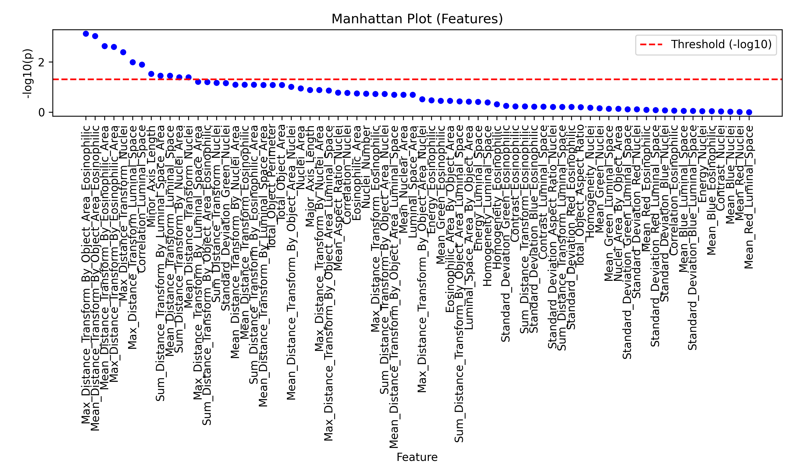

# histoWAS
Histopathological, proteomics association

## Quick Start

1. Environment Setup
   - The file `environment.yml` contains the environment configuration. Please use this file to set up all necessary dependencies.

2. Data Files
   - All required data files are located in the `data` folder.

3. Running the Demo
   - To run the demo, execute the script `histowas_main_demo.py`. For example:
     ```bash
     python histowas_main_demo.py
     ```

4. Results
   - The output from the demo will be saved in the `result` folder.
   - Below are some example plots generated by the demo.

   
### Example Plots

#### 1. Manhattan Plot


#### 2. Effect Size Plot


#### 3. Volcano Plot

